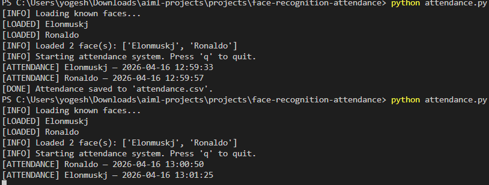

# 🚗 Drowsiness Driver Alert System

<p align="center">
  
</p>

<p align="center">
  
</p>

Real-time drowsiness detection system using **Eye Aspect Ratio (EAR)** computed from facial landmarks.
Triggers an alert when prolonged eye closure is detected — helping prevent driver fatigue accidents.

---

## 🧠 Overview

Driver fatigue is a major cause of road accidents.
This system uses **computer vision + facial landmark detection** to monitor eye activity and detect drowsiness in real time.

---

## ⚙️ How It Works

* Detects face using dlib’s HOG-based detector
* Extracts **68 facial landmarks**
* Identifies eye regions
* Computes **Eye Aspect Ratio (EAR)**
* If EAR stays below threshold → triggers alarm

### 📐 Formula

```
EAR = (|p2−p6| + |p3−p5|) / (2 × |p1−p4|)
```

* Eyes open → EAR ≈ 0.3+
* Eyes closed → EAR ≈ 0

---

## 🚨 Detection Logic

* `EAR_THRESHOLD = 0.25`
* `EAR_CONSEC_FRAMES = 20`

If EAR < threshold for consecutive frames → **DROWSINESS ALERT ⚠️**

---

## 🛠️ Tech Stack

| Library | Purpose                    |
| ------- | -------------------------- |
| dlib    | Face detection + landmarks |
| OpenCV  | Webcam processing          |
| scipy   | Distance calculation       |
| pygame  | Alarm sound                |
| imutils | Utility functions          |
| numpy   | Numerical operations       |

---


Output Terminal:
<p align="center">
  
</p>

## 🚀 Setup

### 1️⃣ Install dependencies

```bash
pip install -r requirements.txt
```

---

### 2️⃣ Download Landmark Model

Download from:
http://dlib.net/files/shape_predictor_68_face_landmarks.dat.bz2

Extract and place in project folder:

```
shape_predictor_68_face_landmarks.dat
```

---

### 3️⃣ Run the project

```bash
python drowsiness_alert.py
```

Press **Q** to quit.

---

## 📂 Project Structure

```
drowsiness-driver-alert/
├── drowsiness_alert.py
├── alert.wav
├── requirements.txt
├── images/
│   └── demo.png
└── README.md
```

---

## ⚠️ Limitations

* Requires webcam access
* Sensitive to lighting conditions
* Not suitable for cloud deployment

---

## 💡 Future Improvements

* 📱 Mobile app version
* 🧠 Deep learning eye-state classifier
* 🌐 Web-based camera integration
* 🚗 Vehicle system integration

---

## 👨‍💻 Author

**Harish Nagarajan**
AI/ML Developer | Computer Vision Enthusiast

---

## ⭐ Support

If you found this useful, give it a ⭐ on GitHub!
